# Guideline Slack

Pra tornar a nossa vida mais fácil reunimos um conjunto de boas práticas em busca de otimizarmos o uso do Slack no dia a dia, além disso criamos algumas regras básicas de prefixos e padrões.

Abrimos esse documento para colaboração de todos, com a possibilidade dar opiniões e fazer comentários. Faça o login com sua conta gmail Centauro e nos ajude a evoluir.

---

## Channels / Canais

Channels (ou Canais) são as "salas" onde ocorrem toda a colaboração e comunicação dentro da plataforma. O objetivo dos canais é que a comunicação sobre tópicos, assuntos e projetos específicos, assim como a comunicação entre equipes e times fiquem agrupadas e categorizadas, tornando assim mais fácil a busca por certas informações e ou pessoas.

### Descrição

Quando criar um canal, crie também uma descrição, detalhando qual o objetivo dele.

### Channels > inbox/direct

Sempre que tiver que conversar com alguém do seu time/chapter/projeto/equipe e o assunto não for pessoal ou privado, favoreça iniciar a conversa no channel e não no inbox. Conversar no Channel faz com que toda equipe tenha acesso e conhecimento sobre o que está acontecendo, facilitando a disseminação e o acesso a informações que poderiam ficar escondidas em mensagens privadas.

### Channel Público X Channel Privado

Como o Slack tem o intuito de facilitar a comunicação e o acesso a informação, a gente prefere muito que as equipes, times e projetos sejam todos em Canais públicos. Claro, em algumas situações específicas canais privados são necessários, mas sempre favoreça o canal público de comunicação.

### Regras de postagens

Alguns canais podem ter regras específicas para postagem de mensagens. Nesses casos, é importantes que essas regras estejam claramente escritas nos tópicos daquele canal e sejam "auditadas" organicamente pelos participantes. Para isso, basta reagir à mensagem postada incorretamente com o ícone :wrong: (dar aquele toque na pessoa sempre é bom, também :D ).

### **Canais Especiais**

Como na Centauro nosso time é de todes, temos alguns channels no Slack voltados para diversidade. Voltado para quem se identifica mulher, existe o channel #mulheresemtech, e para pessoas que se identificam como negros ou pardos, o channel #diversidade-black-sbf. Para participar do #diversidade-black-sbf, basta buscar a # no campo de pesquisa, e solicitar o acesso no canal. Já para participar do #mulheresemtech, fale com Maria Julia Lobo no Slack. Os canais servem para acolher a todes! <3

Além dos canais de pautas de diversidade, para os amantes de animais, o canal #x-fotosdebichosfofos é perfeito!

### Estrutura de nomes dos canais

#### Prefixos de canal

##### _team-_

Canais de um time específico, contendo apenas os membros do time

*Ex: time-vitrines / time-checkout*

##### _chpt-_

Canais contendo apenas membros dos respectivos chapter

*Ex: chpt-design / chpt-sales*

##### _guild-_

Canais contendo apenas membros das respectivas guildas

*Ex: guild-design-mkt / guild-front-back*

##### _area-_

Canais que englobam áreas inteiras.

*Ex: area-SRE / area-ecommerce*

##### _sbox-_

Canais sandbox específicos para uso de single channel users de outras empresas.

*Ex: sbox-ciandt / sbox-juni*

##### _proj-_

Canais para projetos específicos, que terão uma certa duração, e engloba multiplas squads, tribos, guildas ou indivíduos.

*Ex: proj-reestrutura / proj-redesign*

##### _alerts-_

Canais para integrações e alertas automatizados. Normalmente são divididos por times.

*Ex: alert-post-sales / alert-product*

##### _x-_

Canais para discussões aleatórias, pra canais mais descontraídos.

*Ex: x-cafezinho-design / x-happy-hour-front*

### Canais oficiais

#### _#general_

Canal de comunicação geral

#### _#announcements_

Canal para avisos da empresa

#### _#deploy_

Canal aonde serão reportados e documentados todos os deploys que acontecerem.

---

## Perfil

Manter seu perfil completo e atualizado no Slack é um passo muito importante pra que seja mais fácil que as pessoas que precisam falar com você consigam te encontrar.

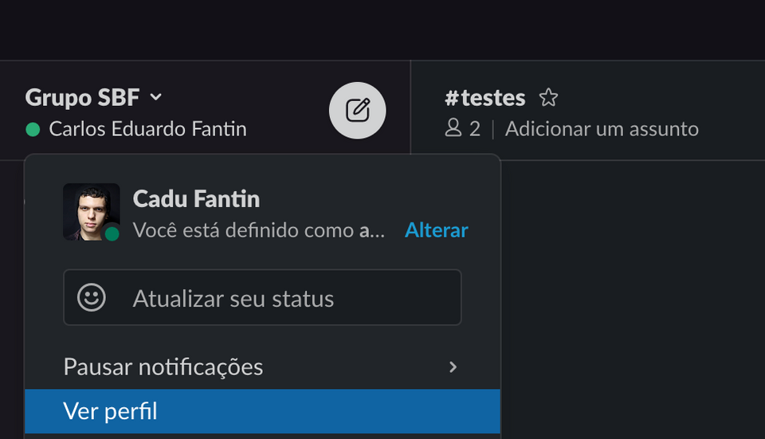

### Nome Exibido X Nome Completo

A unica diferença é que o nome exibido vai ser o que servirá como seu identificado no Slack, que vai aparecer nas conversas e que as pessoas vão ter que digitar depois do `@` para te marcar. Pode ser um apelido pelo qual o pessoal te chama, contanto que as pessoas consigam saber que é você!

### Coloque seu Cargo + Time

Algumas pessoas querem falar com você, mas não sabem quem você é. Ter seu perfil atualizado, com **seu cargo e o time que você faz parte** vai facilitar essa busca.

Veja o exemplo abaixo: 

### Coloque uma foto 😃

Ter uma foto ajuda muito para que as pessoas que ja te conhecem te encontrem, e que saibam com quem estão falando.

### Status

Você pode colocar seu status para que as pessoas saibam sobre sua disponibilidade no momento.

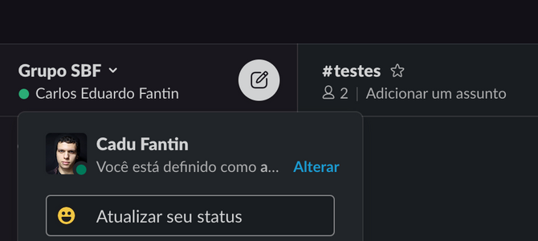

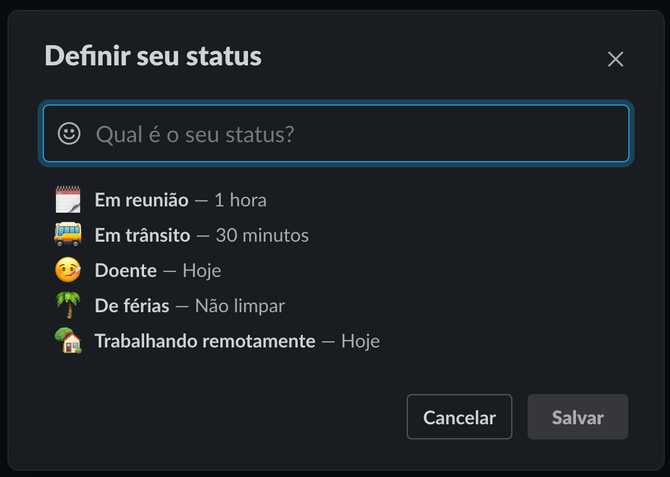

Você também pode colocar apps como o Google Calendar para mudar seu status automaticamente quando estiver em reunião.

---

## Comunicação Assíncrona

Comunicação assíncrona é a comunicação que não ocorre exatamente ao mesmo tempo, não-simultânea. Dessa forma, a mensagem emitida por uma pessoa é recebida e respondida mais tarde pelas outras.
O Slack é uma ferramenta que serve para comunicação síncrona e assíncrona, mas deveríamos sempre favorecer a ideia de que a pessoa não vai poder nos responder imediatamente.

### Digite tudo antes de enviar

Tente colocar tudo que quer dizer em uma só mensagem, ao invés de escrever a mensagem de pouco em pouco e ir enviando apenas partes dela. Isso dificulta a leitura, e faz com que as pessoas fiquem aguardando que todo o texto seja formado, ao contrário de só ler tudo e já responder.

Condensar toda mensagem em um envio só também facilita para criar conversas em threads

### Threads/Conversas

Threads são uma forma de condensar toda a conversa sobre um tópico específico dentro de um post só. A recomendação é que sempre que você for responder a uma pergunta, ou falar sobre algo que foi postado, você faça isso utilizando as threads.

### Utilizando `@mentions` e `@channel`/`@here`/`@aqui`

Quando precisar da atenção de alguém, ou de um grupo de pessoas quando postando alguma coisa, você pode usar as mentions no Slack.

Se você digitar `@` acompanhado do nome da pessoa ela vai receber a notificação do seu post (Desde que seja num channel público, ou em um privado qdo qual ela faz parte).

`@aqui` ou `@here` notifica todas as pessoas em um canal, que estejam online. 

`@channel` notifica todas as pessoas que estejam no canal, independente de estarem ativas ou não.

Evite usar estas duas últimas funções, apenas em casos extremos.

---

## Notificações

As notificações no Slack são muito customizáveis. Cada canal pode ter seus tipos de notificação customizadas, assim como diferentes devices (Desktop / Mobile) e horários do dia.

### Notificações gerais

Nas preferências do Slack você pode encontrar as configurações padrão de notificação, que valeram pra todos os canais que veocê seja membro ( e que não tenham configurações específicas de notificação) 

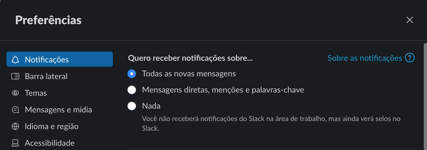

### Notificações apenas no horário de trabalho

Nas mesmas preferências gerais, você pode escolher um período que não gostaria de receber mais notificações do Slack.

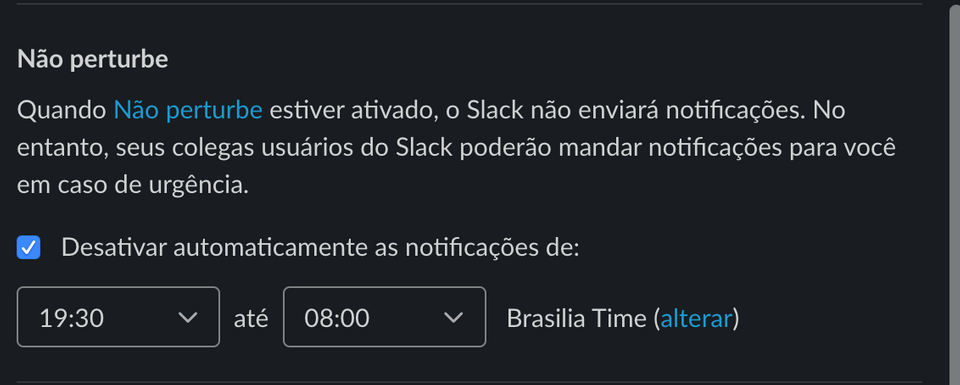

### Notificações por canal

Dentro de um canal, em detalhes você encontra as configurações de notificações do canal. Também é possível ja aí mesmo especificar se as configurações servem para desktop e mobile

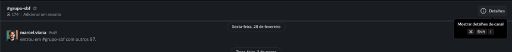

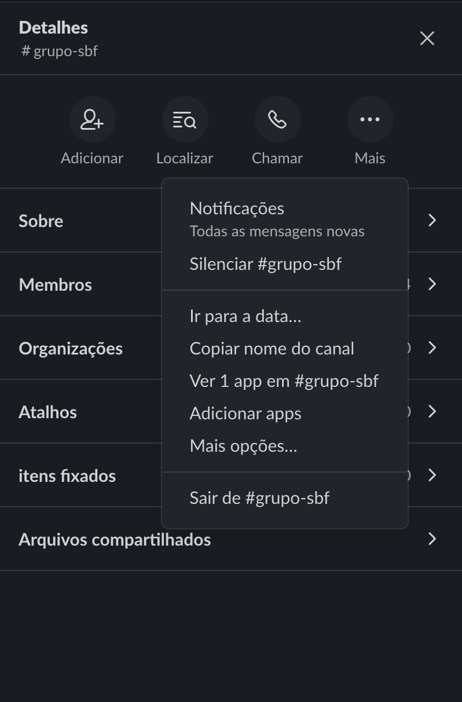

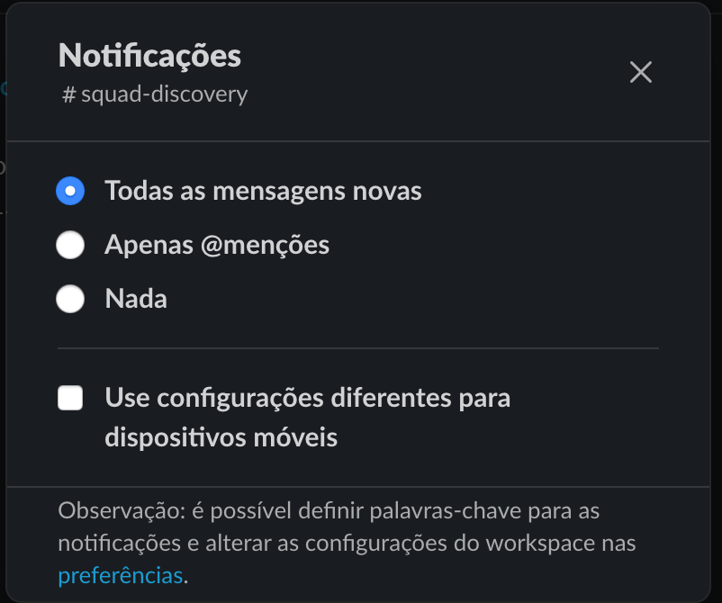

## Apps para Slack

### **Felipão (bot)**

Aqui no slack, nosso técnico está de olho em todos que estão chegando, e claro, já preparando a escalação do campeonato. O Felipão, é o nosso bot técnico do Slack, e vai ajudar você a conhecer nossos times de tecnologia. Para isso, você precisa contar pra ele se você é da área de tecnologia, quem é seu líder, e de qual time você faz parte. Você também pode escalar outras pessoas, e tudo isso utilizando os comandos do bot, que são:

- Configurar time <nome-do-time> - Abre a configuração do time. Aqui é possível selecionar campo de jogo, tags e incluir emails, textos e links ao time.
- Ficha técnica do time <nome-do-time> - Mostra a ficha técnica do time contendo canal oficial, tags, textos, links e emails configurados.
- Escalar pessoa `@nome-de-usuário` no time <nome do time>- Coloca a pessoa em questão como parte do time.
- Configurar pessoa [`@nome-de-usuário`] - Abre a configuração da pessoa em questão.
- Listar times [com as tags <TAG1>, <TAG2> e <TAG3>] - Mostra a lista de times configurados filtrados pelas tags em questão.
- Escalação do time <nome-do-time> - Mostra a lista de pessoas que fazem parte do time selecionado.

E sempre que sentir dúvidas, digite “ajuda” no chat que o Felipão te mostra esses comandos. E você pode falar com ele tanto diretamente como marcar nos canais.

Como se escalar com o Felipão?

1. O Felipão vai entrar em contato com você, e se você for da área de tecnologia, responda sim.

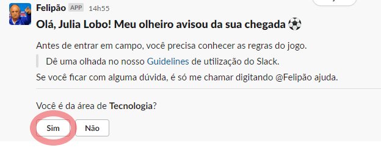

2. Selecione sua liderança

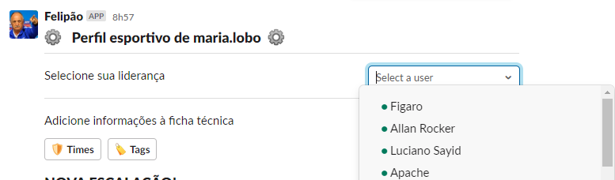

3. Selecione seu time

4. Adicione suas tags

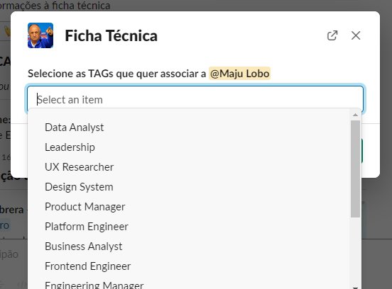

5. Confira as informações!

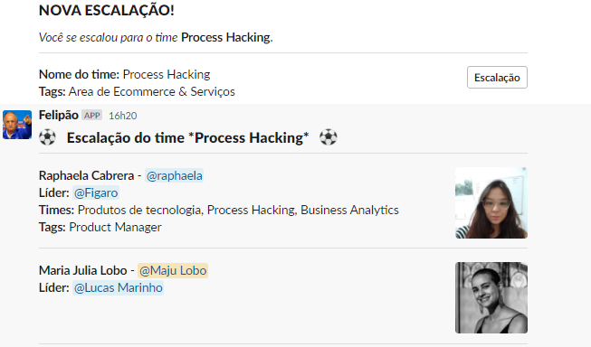

### **Google Calendar**

Você notou que alguns usuários do Slack possuem um emoji de calendário no nickname?

Um dos motivos mais bacanas de ativar essa integração, é que se algum colega precisar falar com você, ele vai saber que talvez sua resposta não seja imediata, e que esse não é o melhor momento para conversar.

Curtiu? Então vamos para o passo-a-passo.

1. Entre neste [link](https://gruposbf.slack.com/apps/ADZ494LHY-google-calendar) aqui e adicione o app ao Slack

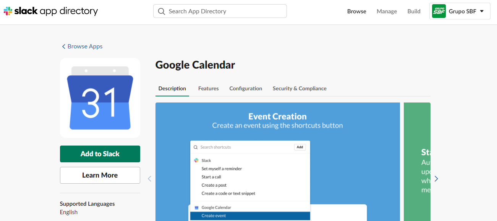

2. Clique em *Allow*

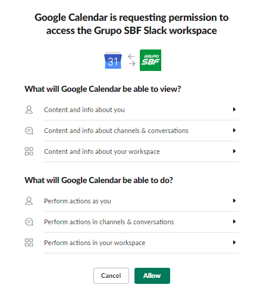

3. Faça login com seu e-mail da Centauro

4. Permita o acesso do Slack ao Google Calendário

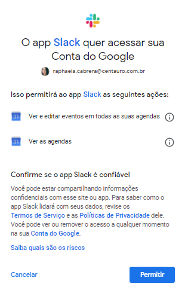

5. O Google Calendar vai te mandar uma DM (fica lá embaixo em APPS) e é preciso clicar em Turn On

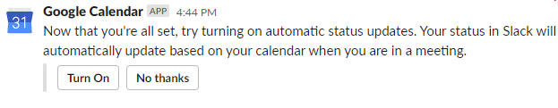

E tá pronto o sorvetinho!

Ah! E você pode criar e cancelar eventos, ou acompanhar a sua agenda no próprio Slack!

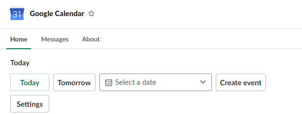

## **Dead Panda**

E depois deste guide completinho de boas práticas, você sabia que toda vez que as *guidelines* não forem seguidas um bebê panda morre? Triste né? Então ajuda a gente aí!

Criamos também um emoji dead-panda para você poder dar um toque no seu amiguinho, caso ele esteja infringindo algum guideline sem ofendê-lo.

